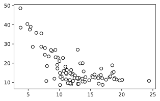
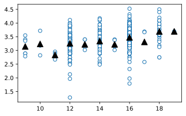
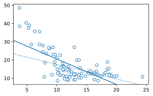
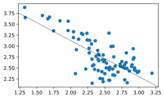
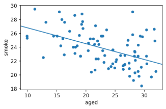
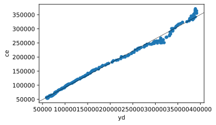
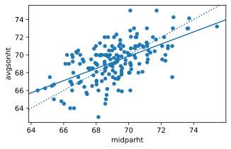

# 3장 단순회귀 모형의 추정

3장 단순회귀 모형의 추정과 관련된 실습을 한다. 데이터와 필요한 파이썬 패키지는 [여기](00-intro.md) 참조.

우선 다음 명령으로 python interpreter를 실행한다.

```console
$ uv run python
```

다음 명령들을 실행한다(복사 → 붙여넣기). 처음 실행할 때에는 시간이 좀 걸릴 수 있으나 그 다음부터는 빨리 될 것이다.

```python
import numpy as np
import pandas as pd
import matplotlib.pyplot as plt
```

## 3.1 자료

### 소득과 환경오염

```python
Ekc = pd.read_csv('csv/loedata/Ekc.csv')
fig = plt.figure(figsize=(8,3.5))
plt.subplot(1,2,1)
plt.scatter(Ekc.gdppcppp, Ekc.co2pc, facecolors='w', edgecolors='k')
#plt.plot(Ekc.gdppcppp, Ekc.co2pc, 'o', mfc='none')
plt.title("In original scale")
plt.subplot(1,2,2)
plt.scatter(Ekc.gdppcppp, Ekc.co2pc, facecolors='w', edgecolors='k')
plt.xscale('log')
plt.yscale('log')
plt.title('In log scale')
plt.show()
```
<!-- fig.savefig('03_files/03_4_0.svg', bbox_inches='tight') -->
    


### 공무원 수 비율과 재정자립도

```python
Pubserv = pd.read_csv('csv/loedata/Pubserv.csv')
Pubserv1 = Pubserv[Pubserv['servpc'] < 28].copy()
fig = plt.figure(figsize=(5,3))
plt.scatter(Pubserv1.servpc, Pubserv1.finind, color='w', edgecolors='k')
plt.show()
```



### 교육수준과 임금

```python
Klips = pd.read_csv('csv/loedata/Klips.csv')
Klips2 = Klips[(Klips['regular']==1) & (Klips['married']==1)].copy()
print(Klips2.shape)
fig = plt.figure(figsize=(5,3))
plt.scatter(Klips2.educ, Klips2.labinc, color='w', edgecolors='k')
#plt.plot(Klips2.educ, Klips2.labinc, 'o', mfc='w')
plt.yscale('log')
plt.show()
```


```python
Klips2['lnlabinc'] = np.log(Klips2['labinc'])
ave = Klips2[['educ','lnlabinc']].groupby(['educ']).mean(['lnlabinc']).reset_index()
print(ave)
```

```text title="Result"
    educ  lnlabinc
0      9  3.145510
1     10  3.239290
2     11  2.837503
3     12  3.262296
4     13  3.223670
5     14  3.342744
6     15  3.223641
7     16  3.476449
8     17  3.312591
9     18  3.693358
10    19  3.696848
```

```python
fig = plt.figure(figsize=(5,3))
plt.plot(Klips2.educ, Klips2.lnlabinc, 'o', mfc='w')
plt.plot(ave['educ'], ave['lnlabinc'], '^', color='black', ms=10)
plt.show()
```



## 3.4 짧은 예제들

이하에서 산포도에 직선을 덧그릴 것인데, 필자가 실험해 본 바로는 직선을 그리면 산포도의 축이 바뀐다. 그러므로 산포도를 그린 다음에 축을 고정시키는 함수를 만들어서 호출하고자 한다. 다음과 같이 <a name="fixlims">`fix_lims` 함수를 정의</a>하고 앞에서 import한 `plt`의 클래스 함수로 이를 추가한다.

```python
## https://stackoverflow.com/questions/972/adding-a-method-to-an-existing-object-instance
# We need this to fixate the limits of plots
import matplotlib.pyplot as plt
def fix_lims(self):
    self.xlim(self.gca().get_xlim())
    self.ylim(self.gca().get_ylim())

# Now patch plt
plt.fix_lims = fix_lims.__get__(plt)

# 위 method를 만들고 싶지 않으면 plt.fix_lims()를 모두 다음으로 교체
# plt.xlim(plt.gca().get_xlim())
# plt.ylim(plt.gca().get_ylim())
```

이제 `plt.fix_lims()`를 호출하면 그림의 축이 고정된다.

### 재정자립도 회귀: OLS와 LAD

```python
from statsmodels.api import OLS, QuantReg
fm = 'finind~servpc'
ols = OLS.from_formula(fm, data = Pubserv1).fit()
lad = QuantReg.from_formula(fm, data = Pubserv1).fit(q=0.5)
```

```python
fig = plt.figure(figsize=(5,3))
plt.plot(Pubserv1.servpc, Pubserv1.finind, 'o', mfc='w')
plt.fix_lims()
plt.axline((0, ols.params['Intercept']), slope=ols.params['servpc'])
plt.axline((0, lad.params['Intercept']), slope=lad.params['servpc'], linestyle=':')
plt.show()
```


    
### 재정자립도 회귀

```python
import pandas as pd
import numpy as np
import statsmodels.formula.api as smf
Pubserv = pd.read_csv('csv/loedata/Pubserv.csv')
Pubserv1 = Pubserv[Pubserv['servpc'] < 28].copy()
ols = smf.ols('np.log(finind)~np.log(servpc)', Pubserv1).fit()
ols.params
```

```text title="Result"
Intercept         4.767454
np.log(servpc)   -0.821201
dtype: float64
```

#### 수동으로 계산 결과 확인

위 결과를 수동으로 계산하고자 한다. Python에서 로그를 취하거나 표본평균, 합계 등은 `numpy` 패키지에 구현되어 있다. 앞에서 `numpy`를 `np`로 import했으므로 `np.log`, `np.mean`, `np.sum` 등이라고 해야 한다.

```python
x = np.log(Pubserv1.servpc)
y = np.log(Pubserv1.finind)
xbar = np.mean(x)
xd = x-xbar
b1 = np.sum(xd*y)/np.sum(xd**2)
b0 = np.mean(y)-b1*xbar
b0,b1
```

```text title="Result"
(4.767453582972257, -0.8212005150740734)
```

#### 데이터와 회귀 직선 그림으로 표시

그림을 그릴 때 축을 고정하기 위해 [여기](#fixlims)에서 `fix_lims()` 메쏘드를 만들었다.

```python
import matplotlib.pyplot as plt
fig = plt.figure(figsize=(5,3))
plt.scatter(x,y)
plt.fix_lims()
plt.axline((0,b0), slope=b1, color='k', lw=0.5)
plt.show()
```
    


직선 색깔을 검정색으로 했는데 별다른 이유가 있어서는 아니고, 색깔 줄 때 어떻게 하는지 알아보려고 한번 해 본 것이다.

### 교육수준과 연간 근로소득

```python
import pandas as pd
import numpy as np
import statsmodels.formula.api as smf
Klips = pd.read_csv('csv/loedata/Klips.csv')
Klips2 = Klips[(Klips['regular']==1) & (Klips['married']==1)].copy()
ols = smf.ols('np.log(labinc)~educ', data = Klips2).fit()
ols.params
```

```text title="Result"
Intercept    2.527273
educ         0.059577
dtype: float64
```

그림을 그릴 때 축을 고정하기 위해 [여기](#fixlims)에서 `fix_lims()` 메쏘드를 만들었다.

```python
import matplotlib.pyplot as plt
fig = plt.figure(figsize=(5,3))
plt.scatter(Klips2.educ, np.log(Klips2.labinc))
plt.fix_lims() # see above
b0,b1 = ols.params
plt.axline((0,b0), slope = b1)
plt.show()
```


### 고령인구비율과 흡연율

```python
import pandas as pd
import statsmodels.formula.api as smf
Death = pd.read_csv('csv/loedata/Death.csv')
Death10 = Death[Death.year==2010].copy()
ols = smf.ols('smoke~aged', data=Death10).fit()
ols.params
```

```text title="Result"
Intercept    29.077420
aged         -0.228558
dtype: float64
```

그림을 그릴 때 축을 고정하기 위해 [여기](#fixlims)에서 `fix_lims()` 메쏘드를 만들었다.

```python
import matplotlib.pyplot as plt
fig = plt.figure(figsize=(5,3))
plt.scatter(Death10.aged, Death10.smoke)
plt.fix_lims()
b0,b1 = ols.params
plt.axline((0,b0), slope=b1)
plt.show()
```




### 소비함수

```python
import pandas as pd
import statsmodels.formula.api as smf
Consumption = pd.read_csv('csv/Ecdat/Consumption.csv')
ols = smf.ols('ce~yd', data = Consumption).fit()
ols.params
```

```text title="Result"
Intercept    6000.256052
yd              0.861788
dtype: float64
```

그림을 그릴 때 축을 고정하기 위해 [여기](#fixlims)에서 `fix_lims()` 메쏘드를 만들었다.

```python
import matplotlib.pyplot as plt
fig = plt.figure(figsize=(5,3))
plt.scatter(Consumption.yd, Consumption.ce)
plt.fix_lims()
b0,b1 = ols.params
plt.axline((0,b0), slope = b1, color='k', lw=0.5)
plt.show()
```



### 유전학과 Galton의 “회귀”


```python
import pandas as pd
import statsmodels.formula.api as smf
Galtonpar = pd.read_csv('csv/loedata/Galtonpar.csv')
ols = smf.ols('avgsonht~midparht', data = Galtonpar).fit()
ols.params
```

```text title="Result"
Intercept    21.752799
midparht      0.687150
dtype: float64
```

그림을 그릴 때 축을 고정하기 위해 [여기](#fixlims)에서 `fix_lims()` 메쏘드를 만들었다.

```python
import matplotlib.pyplot as plt
Galtonpar.plot.scatter(x = 'midparht', y = 'avgsonht', figsize=(5,3))
plt.fix_lims()
b0,b1 = ols.params
plt.axline((0,0), slope = 1, linestyle=':')
plt.axline((0,b0), slope = b1)
plt.show()
```



위 그림에서 점선은 45도선이다.

### 우주의 나이


```python
import pandas as pd
hubble = pd.read_csv('csv/gamair/hubble.csv')
hubble.head(5)
```

```text title="Result"
     Galaxy     y      x
0   NGC0300   133   2.00
1   NGC0925   664   9.16
2  NGC1326A  1794  16.14
3   NGC1365  1594  17.95
4   NGC1425  1473  21.88
```

```python
import statsmodels.formula.api as smf
ols = smf.ols('y~x-1', data = hubble).fit()
ols.params
```

```text title="Result"
x    76.581172
dtype: float64
```

```python
import matplotlib.pyplot as plt
hubble.plot.scatter(x='x', y='y', figsize=(5,3))
plt.axline((0,0), slope=ols.params['x'])
plt.show()
```


### 담배 가격과 판매량

```python
import numpy as np
import pandas as pd
import statsmodels.formula.api as smf
Cigar = pd.read_csv('csv/Ecdat/Cigar.csv')
Cigar90 = Cigar[Cigar.year==90].copy()
ols = smf.ols('np.log(sales)~np.log(price)', data=Cigar90).fit()
ols.params
```

```text title="Result"
Intercept        9.081182
np.log(price)   -0.899229
dtype: float64
```

## 3.6 맞춘값과 잔차

### 재정자립도 회귀

그림을 그릴 때 축을 고정하기 위해 [여기](#fixlims)에서 `fix_lims()` 메쏘드를 만들었다.

```python
import pandas as pd
import numpy as np
import statsmodels.formula.api as smf
Pubserv = pd.read_csv('csv/loedata/Pubserv.csv')
Pubserv1 = Pubserv[Pubserv['servpc'] < 28].copy()
ols = smf.ols('np.log(finind)~np.log(servpc)', data = Pubserv1).fit()
b0,b1 = ols.params
import matplotlib.pyplot as plt
plt.figure(figsize=(5,3))
plt.scatter(np.log(Pubserv1.servpc), np.log(Pubserv1.finind), zorder=1)
plt.fix_lims()
plt.axline((0,b0), slope=b1, linewidth=1, zorder=2)
plt.scatter(np.log(Pubserv1.servpc), ols.fittedvalues, marker = '^', zorder=3)
plt.show()
```


### 잔차합, 설명변수와 잔차의 곱의 합, 맞춘값과 잔차의 곱의 합

```python
print(f"Sum of residuals = {np.sum(ols.resid)}")
print(f"Sum of x*uhat    = {np.sum(ols.resid*np.log(Pubserv1.servpc))}")
print(f"Sum of yhat*uhat = {np.sum(ols.fittedvalues*ols.resid)}")
```

```text title="Result"
Sum of residuals = 9.547918011776346e-14
Sum of x*uhat    = 2.5029978090174154e-13
Sum of yhat*uhat = 2.485095462745335e-13
```

## 3.9 R제곱

### OLS 회귀 결과 요약

```python
print(ols.summary(slim=True))
```

```text title="Result"
                            OLS Regression Results                            
==============================================================================
Dep. Variable:         np.log(finind)   R-squared:                       0.553
Model:                            OLS   Adj. R-squared:                  0.548
No. Observations:                  84   F-statistic:                     101.5
Covariance Type:            nonrobust   Prob (F-statistic):           5.27e-16
==================================================================================
                     coef    std err          t      P>|t|      [0.025      0.975]
----------------------------------------------------------------------------------
Intercept          4.7675      0.202     23.559      0.000       4.365       5.170
np.log(servpc)    -0.8212      0.081    -10.076      0.000      -0.983      -0.659
==================================================================================

Notes:
[1] Standard Errors assume that the covariance matrix of the errors is correctly specified.
```

### SSE/SST = R-squared

아래 두 값은 동일하다.

```python
print((ols.ess/ols.centered_tss, ols.rsquared))
```

```text title="Result"
(0.5532173833344799, 0.55321738333448)
```

## 3.11 측정단위의 변환

### 예제 3.1 단위 변환의 유용성

```python
Ekc = pd.read_csv('csv/loedata/Ekc.csv')
smf.ols('co2pc~gdppcppp', data = Ekc).fit().params
```

```text title="Result"
Intercept   -0.034195
gdppcppp     0.000339
dtype: float64
```

설명변수를 1000으로 나눈 후 회귀하면, 원래 계수추정치에 1000을 곱한 값이 새로운 추정치가 된다.

```python
smf.ols('co2pc~I(gdppcppp/1000)', data = Ekc).fit().params
```

```text title="Result"
Intercept            -0.034195
I(gdppcppp / 1000)    0.339048
dtype: float64
```

### 로그와 측정단위 변환

```python
smf.ols('np.log(co2pc)~np.log(gdppcppp)', data = Ekc).fit().params
```

```text title="Result"
Intercept          -10.283620
np.log(gdppcppp)     1.224789
dtype: float64
```

설명변수가 로그 형태인 경우 설명변수를 1000으로 나누어도 절편 추정치만 영향을 받는다.

```python
smf.ols('np.log(co2pc)~np.log(gdppcppp/1000)', data = Ekc).fit().params
```

```text title="Result"
Intercept                 -1.823079
np.log(gdppcppp / 1000)    1.224789
dtype: float64
```
