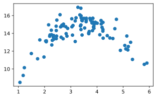
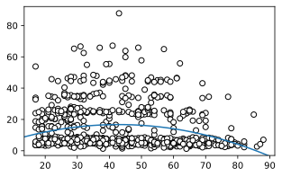
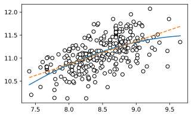

# 11장 다중회귀 관련 추가 주제

## 이진적 설명변수

```python
import pandas as pd
from numpy import log
import statsmodels.formula.api as smf

Wages1 = pd.read_csv('csv/Ecdat/Wages1.csv')
Wages1['female'] = [int(x=='female') for x in Wages1.sex]
ols = smf.ols('log(wage)~school+exper+female', data=Wages1).fit()
ols.summary(slim=True)
```

<table class="simpletable">
<caption>OLS Regression Results</caption>
<tr>
  <th>Dep. Variable:</th>    <td>log(wage)</td> <th>  R-squared:         </th> <td>   0.137</td> 
</tr>
<tr>
  <th>Model:</th>               <td>OLS</td>    <th>  Adj. R-squared:    </th> <td>   0.137</td> 
</tr>
<tr>
  <th>No. Observations:</th>  <td>  3294</td>   <th>  F-statistic:       </th> <td>   174.7</td> 
</tr>
<tr>
  <th>Covariance Type:</th>  <td>nonrobust</td> <th>  Prob (F-statistic):</th> <td>4.04e-105</td>
</tr>
</table>
<table class="simpletable">
<tr>
      <td></td>         <th>coef</th>     <th>std err</th>      <th>t</th>      <th>P>|t|</th>  <th>[0.025</th>    <th>0.975]</th>  
</tr>
<tr>
  <th>Intercept</th> <td>   -0.0168</td> <td>    0.088</td> <td>   -0.192</td> <td> 0.848</td> <td>   -0.188</td> <td>    0.155</td>
</tr>
<tr>
  <th>school</th>    <td>    0.1234</td> <td>    0.006</td> <td>   19.802</td> <td> 0.000</td> <td>    0.111</td> <td>    0.136</td>
</tr>
<tr>
  <th>exper</th>     <td>    0.0354</td> <td>    0.005</td> <td>    7.845</td> <td> 0.000</td> <td>    0.027</td> <td>    0.044</td>
</tr>
<tr>
  <th>female</th>    <td>   -0.2426</td> <td>    0.020</td> <td>  -11.860</td> <td> 0.000</td> <td>   -0.283</td> <td>   -0.202</td>
</tr>
</table>
<div class="reg-notes">
Notes:<br/>[1] Standard Errors assume that the covariance matrix of the errors is correctly specified.
</div>


## 상호작용항


```python
# Continue
ols = smf.ols('log(wage)~female*school+exper', data=Wages1).fit()
ols.summary(slim=True)
```


<table class="simpletable">
<caption>OLS Regression Results</caption>
<tr>
  <th>Dep. Variable:</th>    <td>log(wage)</td> <th>  R-squared:         </th> <td>   0.137</td> 
</tr>
<tr>
  <th>Model:</th>               <td>OLS</td>    <th>  Adj. R-squared:    </th> <td>   0.136</td> 
</tr>
<tr>
  <th>No. Observations:</th>  <td>  3294</td>   <th>  F-statistic:       </th> <td>   131.0</td> 
</tr>
<tr>
  <th>Covariance Type:</th>  <td>nonrobust</td> <th>  Prob (F-statistic):</th> <td>5.79e-104</td>
</tr>
</table>
<table class="simpletable">
<tr>
        <td></td>           <th>coef</th>     <th>std err</th>      <th>t</th>      <th>P>|t|</th>  <th>[0.025</th>    <th>0.975]</th>  
</tr>
<tr>
  <th>Intercept</th>     <td>   -0.0122</td> <td>    0.109</td> <td>   -0.112</td> <td> 0.911</td> <td>   -0.226</td> <td>    0.201</td>
</tr>
<tr>
  <th>female</th>        <td>   -0.2529</td> <td>    0.148</td> <td>   -1.714</td> <td> 0.087</td> <td>   -0.542</td> <td>    0.036</td>
</tr>
<tr>
  <th>school</th>        <td>    0.1230</td> <td>    0.008</td> <td>   15.003</td> <td> 0.000</td> <td>    0.107</td> <td>    0.139</td>
</tr>
<tr>
  <th>female:school</th> <td>    0.0009</td> <td>    0.012</td> <td>    0.071</td> <td> 0.944</td> <td>   -0.024</td> <td>    0.025</td>
</tr>
<tr>
  <th>exper</th>         <td>    0.0354</td> <td>    0.005</td> <td>    7.793</td> <td> 0.000</td> <td>    0.026</td> <td>    0.044</td>
</tr>
</table>
<div class="reg-notes">
Notes:<br/>[1] Standard Errors assume that the covariance matrix of the errors is correctly specified.
</div>


## 집단별 회귀와 전체 회귀


```python
# Continue
eqa = smf.ols('log(wage)~school', data=Wages1).fit()
eqb = smf.ols('log(wage)~school+female', data=Wages1).fit()
eqc = smf.ols('log(wage)~school*female', data=Wages1).fit()
eqd = smf.ols('log(wage)~school', data=Wages1[Wages1.female==0]).fit()
eqe = smf.ols('log(wage)~school', data=Wages1[Wages1.female==1]).fit()
```


```python
#https://economics.stackexchange.com/questions/11774/outputting-regressions-as-table-in-python-similar-to-outreg-in-stata
from statsmodels.iolib.summary2 import summary_col

outreg = summary_col([eqa,eqb,eqc,eqd,eqe], stars=True)
outreg # Why do I have R-squared and R-squared Adj.?
```


<table class="simpletable">
<tr>
         <td></td>        <th>log(wage) I</th> <th>log(wage) II</th> <th>log(wage) III</th> <th>log(wage) IIII</th> <th>log(wage) IIIII</th>
</tr>
<tr>
  <th>Intercept</th>       <td>0.3639***</td>    <td>0.3793***</td>    <td>0.4326***</td>      <td>0.4326***</td>       <td>0.0419</td>     
</tr>
<tr>
  <th></th>                <td>(0.0738)</td>     <td>(0.0721)</td>     <td>(0.0937)</td>       <td>(0.0908)</td>       <td>(0.1181)</td>    
</tr>
<tr>
  <th>school</th>          <td>0.1052***</td>    <td>0.1145***</td>    <td>0.1099***</td>      <td>0.1099***</td>      <td>0.1210***</td>   
</tr>
<tr>
  <th></th>                <td>(0.0063)</td>     <td>(0.0062)</td>     <td>(0.0081)</td>       <td>(0.0078)</td>       <td>(0.0099)</td>    
</tr>
<tr>
  <th>female</th>              <td></td>        <td>-0.2601***</td>   <td>-0.3907***</td>          <td></td>               <td></td>        
</tr>
<tr>
  <th></th>                    <td></td>         <td>(0.0205)</td>     <td>(0.1478)</td>           <td></td>               <td></td>        
</tr>
<tr>
  <th>school:female</th>       <td></td>             <td></td>          <td>0.0112</td>            <td></td>               <td></td>        
</tr>
<tr>
  <th></th>                    <td></td>             <td></td>         <td>(0.0125)</td>           <td></td>               <td></td>        
</tr>
<tr>
  <th>R-squared</th>        <td>0.0784</td>       <td>0.1213</td>       <td>0.1215</td>         <td>0.1021</td>         <td>0.0873</td>     
</tr>
<tr>
  <th>R-squared Adj.</th>   <td>0.0781</td>       <td>0.1208</td>       <td>0.1207</td>         <td>0.1016</td>         <td>0.0867</td>     
</tr>
</table>
<div class="reg-notes">
Standard errors in parentheses.<br/>
* p<.1, ** p<.05, ***p<.01
</div>


## 예제 11.1 Card and Krueger (1994)


```python
import pandas as pd
import statsmodels.formula.api as smf

Fastfood = pd.read_csv('csv/loedata/Fastfood.csv')
ols = smf.ols('fte~after', data=Fastfood[Fastfood.nj==1]).fit()
ols.summary(slim=True)
```


<table class="simpletable">
<caption>OLS Regression Results</caption>
<tr>
  <th>Dep. Variable:</th>       <td>fte</td>    <th>  R-squared:         </th> <td>   0.001</td>
</tr>
<tr>
  <th>Model:</th>               <td>OLS</td>    <th>  Adj. R-squared:    </th> <td>  -0.001</td>
</tr>
<tr>
  <th>No. Observations:</th>  <td>   640</td>   <th>  F-statistic:       </th> <td>  0.6536</td>
</tr>
<tr>
  <th>Covariance Type:</th>  <td>nonrobust</td> <th>  Prob (F-statistic):</th>  <td> 0.419</td> 
</tr>
</table>
<table class="simpletable">
<tr>
      <td></td>         <th>coef</th>     <th>std err</th>      <th>t</th>      <th>P>|t|</th>  <th>[0.025</th>    <th>0.975]</th>  
</tr>
<tr>
  <th>Intercept</th> <td>   20.4394</td> <td>    0.513</td> <td>   39.805</td> <td> 0.000</td> <td>   19.431</td> <td>   21.448</td>
</tr>
<tr>
  <th>after</th>     <td>    0.5880</td> <td>    0.727</td> <td>    0.808</td> <td> 0.419</td> <td>   -0.840</td> <td>    2.016</td>
</tr>
</table>
<div class="reg-notes">
Notes:<br/>[1] Standard Errors assume that the covariance matrix of the errors is correctly specified.
</div>


```python
smf.ols('fte~after', data=Fastfood[Fastfood.nj==0]).fit().summary(slim=True)
```


<table class="simpletable">
<caption>OLS Regression Results</caption>
<tr>
  <th>Dep. Variable:</th>       <td>fte</td>    <th>  R-squared:         </th> <td>   0.011</td>
</tr>
<tr>
  <th>Model:</th>               <td>OLS</td>    <th>  Adj. R-squared:    </th> <td>   0.005</td>
</tr>
<tr>
  <th>No. Observations:</th>  <td>   154</td>   <th>  F-statistic:       </th> <td>   1.727</td>
</tr>
<tr>
  <th>Covariance Type:</th>  <td>nonrobust</td> <th>  Prob (F-statistic):</th>  <td> 0.191</td> 
</tr>
</table>
<table class="simpletable">
<tr>
      <td></td>         <th>coef</th>     <th>std err</th>      <th>t</th>      <th>P>|t|</th>  <th>[0.025</th>    <th>0.975]</th>  
</tr>
<tr>
  <th>Intercept</th> <td>   23.3312</td> <td>    1.165</td> <td>   20.024</td> <td> 0.000</td> <td>   21.029</td> <td>   25.633</td>
</tr>
<tr>
  <th>after</th>     <td>   -2.1656</td> <td>    1.648</td> <td>   -1.314</td> <td> 0.191</td> <td>   -5.421</td> <td>    1.090</td>
</tr>
</table>
<div class="reg-notes">
Notes:<br/>[1] Standard Errors assume that the covariance matrix of the errors is correctly specified.
</div>


```python
smf.ols('fte~nj', data=Fastfood[Fastfood.after==0]).fit().summary(slim=True)
```


<table class="simpletable">
<caption>OLS Regression Results</caption>
<tr>
  <th>Dep. Variable:</th>       <td>fte</td>    <th>  R-squared:         </th> <td>   0.014</td>
</tr>
<tr>
  <th>Model:</th>               <td>OLS</td>    <th>  Adj. R-squared:    </th> <td>   0.011</td>
</tr>
<tr>
  <th>No. Observations:</th>  <td>   398</td>   <th>  F-statistic:       </th> <td>   5.525</td>
</tr>
<tr>
  <th>Covariance Type:</th>  <td>nonrobust</td> <th>  Prob (F-statistic):</th>  <td>0.0192</td> 
</tr>
</table>
<table class="simpletable">
<tr>
      <td></td>         <th>coef</th>     <th>std err</th>      <th>t</th>      <th>P>|t|</th>  <th>[0.025</th>    <th>0.975]</th>  
</tr>
<tr>
  <th>Intercept</th> <td>   23.3312</td> <td>    1.105</td> <td>   21.118</td> <td> 0.000</td> <td>   21.159</td> <td>   25.503</td>
</tr>
<tr>
  <th>nj</th>        <td>   -2.8918</td> <td>    1.230</td> <td>   -2.351</td> <td> 0.019</td> <td>   -5.310</td> <td>   -0.473</td>
</tr>
</table>
<div class="reg-notes">
Notes:<br/>[1] Standard Errors assume that the covariance matrix of the errors is correctly specified.
</div>


```python
smf.ols('fte~nj', data=Fastfood[Fastfood.after==1]).fit().summary(slim=True)
```


<table class="simpletable">
<caption>OLS Regression Results</caption>
<tr>
  <th>Dep. Variable:</th>       <td>fte</td>    <th>  R-squared:         </th> <td>   0.000</td>
</tr>
<tr>
  <th>Model:</th>               <td>OLS</td>    <th>  Adj. R-squared:    </th> <td>  -0.003</td>
</tr>
<tr>
  <th>No. Observations:</th>  <td>   396</td>   <th>  F-statistic:       </th> <td> 0.01428</td>
</tr>
<tr>
  <th>Covariance Type:</th>  <td>nonrobust</td> <th>  Prob (F-statistic):</th>  <td> 0.905</td> 
</tr>
</table>
<table class="simpletable">
<tr>
      <td></td>         <th>coef</th>     <th>std err</th>      <th>t</th>      <th>P>|t|</th>  <th>[0.025</th>    <th>0.975]</th>  
</tr>
<tr>
  <th>Intercept</th> <td>   21.1656</td> <td>    1.038</td> <td>   20.397</td> <td> 0.000</td> <td>   19.125</td> <td>   23.206</td>
</tr>
<tr>
  <th>nj</th>        <td>   -0.1382</td> <td>    1.156</td> <td>   -0.119</td> <td> 0.905</td> <td>   -2.411</td> <td>    2.135</td>
</tr>
</table>
<div class="reg-notes">
Notes:<br/>[1] Standard Errors assume that the covariance matrix of the errors is correctly specified.
</div>


```python
smf.ols('fte~nj*after', data=Fastfood).fit().summary(slim=True)
```


<table class="simpletable">
<caption>OLS Regression Results</caption>
<tr>
  <th>Dep. Variable:</th>       <td>fte</td>    <th>  R-squared:         </th> <td>   0.007</td>
</tr>
<tr>
  <th>Model:</th>               <td>OLS</td>    <th>  Adj. R-squared:    </th> <td>   0.004</td>
</tr>
<tr>
  <th>No. Observations:</th>  <td>   794</td>   <th>  F-statistic:       </th> <td>   1.964</td>
</tr>
<tr>
  <th>Covariance Type:</th>  <td>nonrobust</td> <th>  Prob (F-statistic):</th>  <td> 0.118</td> 
</tr>
</table>
<table class="simpletable">
<tr>
      <td></td>         <th>coef</th>     <th>std err</th>      <th>t</th>      <th>P>|t|</th>  <th>[0.025</th>    <th>0.975]</th>  
</tr>
<tr>
  <th>Intercept</th> <td>   23.3312</td> <td>    1.072</td> <td>   21.767</td> <td> 0.000</td> <td>   21.227</td> <td>   25.435</td>
</tr>
<tr>
  <th>nj</th>        <td>   -2.8918</td> <td>    1.194</td> <td>   -2.423</td> <td> 0.016</td> <td>   -5.235</td> <td>   -0.549</td>
</tr>
<tr>
  <th>after</th>     <td>   -2.1656</td> <td>    1.516</td> <td>   -1.429</td> <td> 0.154</td> <td>   -5.141</td> <td>    0.810</td>
</tr>
<tr>
  <th>nj:after</th>  <td>    2.7536</td> <td>    1.688</td> <td>    1.631</td> <td> 0.103</td> <td>   -0.561</td> <td>    6.068</td>
</tr>
</table>
<div class="reg-notes">
Notes:<br/>[1] Standard Errors assume that the covariance matrix of the errors is correctly specified.
</div>


```python
#https://stackoverflow.com/questions/13413590/how-to-drop-rows-of-pandas-dataframe-whose-value-in-a-certain-column-is-nan
Fastfood = pd.read_csv('csv/loedata/Fastfood.csv')
print('Original:', Fastfood.shape)
Fastfood = Fastfood.dropna(subset = ['id','fte','nj','after'])
print('Cleaned :', Fastfood.shape)
mod = smf.ols('fte~nj*after', data=Fastfood)
```

    Original: (820, 35)
    Cleaned : (794, 35)


```python
mod.fit(cov_type='cluster', cov_kwds={'groups': Fastfood['id']}).summary(slim=True)
```


<table class="simpletable">
<caption>OLS Regression Results</caption>
<tr>
  <th>Dep. Variable:</th>      <td>fte</td>   <th>  R-squared:         </th> <td>   0.007</td>
</tr>
<tr>
  <th>Model:</th>              <td>OLS</td>   <th>  Adj. R-squared:    </th> <td>   0.004</td>
</tr>
<tr>
  <th>No. Observations:</th> <td>   794</td>  <th>  F-statistic:       </th> <td>   1.802</td>
</tr>
<tr>
  <th>Covariance Type:</th>  <td>cluster</td> <th>  Prob (F-statistic):</th>  <td> 0.146</td> 
</tr>
</table>
<table class="simpletable">
<tr>
      <td></td>         <th>coef</th>     <th>std err</th>      <th>z</th>      <th>P>|z|</th>  <th>[0.025</th>    <th>0.975]</th>  
</tr>
<tr>
  <th>Intercept</th> <td>   23.3312</td> <td>    1.347</td> <td>   17.327</td> <td> 0.000</td> <td>   20.692</td> <td>   25.970</td>
</tr>
<tr>
  <th>nj</th>        <td>   -2.8918</td> <td>    1.440</td> <td>   -2.009</td> <td> 0.045</td> <td>   -5.713</td> <td>   -0.070</td>
</tr>
<tr>
  <th>after</th>     <td>   -2.1656</td> <td>    1.218</td> <td>   -1.778</td> <td> 0.075</td> <td>   -4.553</td> <td>    0.222</td>
</tr>
<tr>
  <th>nj:after</th>  <td>    2.7536</td> <td>    1.307</td> <td>    2.107</td> <td> 0.035</td> <td>    0.193</td> <td>    5.315</td>
</tr>
</table>
<div class="reg-notes">
Notes:<br/>[1] Standard Errors are robust to cluster correlation (cluster)
</div>


## 제곱항 자료 생성


```python
import numpy as np
import matplotlib.pyplot as plt

np.random.seed(101)
n = 100
x = np.random.normal(loc=3.2, scale=1, size=n)
u = np.random.normal(scale=.75, size=n)
y = 3+7*x-x**2+u
```


```python
plt.figure(figsize=(5,3))
plt.scatter(x,y)
plt.show()
```


    

    


## 예제 11.2 나이의 2차 함수로서의 흡연량


```python
import pandas as pd
from numpy import log
import statsmodels.formula.api as smf

smoke = pd.read_csv('csv/wooldridge/smoke.csv')
ols = smf.ols('cigs~log(income)+log(cigpric)+educ+age+agesq', data=smoke).fit()
ols.summary(slim=True)
```


<table class="simpletable">
<caption>OLS Regression Results</caption>
<tr>
  <th>Dep. Variable:</th>      <td>cigs</td>    <th>  R-squared:         </th> <td>   0.045</td>
</tr>
<tr>
  <th>Model:</th>               <td>OLS</td>    <th>  Adj. R-squared:    </th> <td>   0.039</td>
</tr>
<tr>
  <th>No. Observations:</th>  <td>   807</td>   <th>  F-statistic:       </th> <td>   7.565</td>
</tr>
<tr>
  <th>Covariance Type:</th>  <td>nonrobust</td> <th>  Prob (F-statistic):</th> <td>5.92e-07</td>
</tr>
</table>
<table class="simpletable">
<tr>
        <td></td>          <th>coef</th>     <th>std err</th>      <th>t</th>      <th>P>|t|</th>  <th>[0.025</th>    <th>0.975]</th>  
</tr>
<tr>
  <th>Intercept</th>    <td>    5.3688</td> <td>   23.897</td> <td>    0.225</td> <td> 0.822</td> <td>  -41.540</td> <td>   52.277</td>
</tr>
<tr>
  <th>log(income)</th>  <td>    0.7583</td> <td>    0.729</td> <td>    1.041</td> <td> 0.298</td> <td>   -0.672</td> <td>    2.189</td>
</tr>
<tr>
  <th>log(cigpric)</th> <td>   -2.8532</td> <td>    5.733</td> <td>   -0.498</td> <td> 0.619</td> <td>  -14.107</td> <td>    8.401</td>
</tr>
<tr>
  <th>educ</th>         <td>   -0.5141</td> <td>    0.168</td> <td>   -3.068</td> <td> 0.002</td> <td>   -0.843</td> <td>   -0.185</td>
</tr>
<tr>
  <th>age</th>          <td>    0.7806</td> <td>    0.161</td> <td>    4.860</td> <td> 0.000</td> <td>    0.465</td> <td>    1.096</td>
</tr>
<tr>
  <th>agesq</th>        <td>   -0.0091</td> <td>    0.002</td> <td>   -5.207</td> <td> 0.000</td> <td>   -0.013</td> <td>   -0.006</td>
</tr>
</table>
<div class="reg-notes">
Notes:<br/>[1] Standard Errors assume that the covariance matrix of the errors is correctly specified.<br/>[2] The condition number is large, 1.32e+05. This might indicate that there are<br/>strong multicollinearity or other numerical problems.
</div>


```python
-ols.params.age/(2*ols.params.agesq)
```


    42.86552149669145


```python
#https://pandas.pydata.org/docs/getting_started/intro_tutorials/06_calculate_statistics.html
smoke.age.describe()
```


    count    807.000000
    mean      41.237918
    std       17.027285
    min       17.000000
    25%       28.000000
    50%       38.000000
    75%       54.000000
    max       88.000000
    Name: age, dtype: float64


```python
#https://stackoverflow.com/questions/33768122/python-pandas-dataframe-how-to-multiply-entire-column-with-a-scalar
#https://stackoverflow.com/questions/53162/how-can-i-do-a-line-break-line-continuation-in-python
smoke['pred0'] = ols.params.Intercept \
               + log(smoke.income)*ols.params['log(income)'] \
               + log(smoke.cigpric)*ols.params['log(cigpric)'] \
               + smoke.educ*ols.params.educ
```


```python
import numpy as np
import matplotlib.pyplot as plt

plt.figure(figsize=(5,3))
plt.scatter(smoke.age, smoke.cigs-smoke.pred0, color='w', edgecolors='k')
plt.xlim(plt.gca().get_xlim()) # fix x limits
plt.ylim(plt.gca().get_ylim()) # fix y limits
x = np.arange(100)
plt.plot(x, x*ols.params.age+(x**2)*ols.params.agesq)
plt.show()
```


    

    


## 예제 11.3 건평과 주택가격


```python
import pandas as pd
from numpy import log
import statsmodels.formula.api as smf

Housing = pd.read_csv('csv/Ecdat/Housing.csv')
H3 = Housing[Housing.bedrooms==3].copy()
ols2 = smf.ols('log(price)~log(lotsize)+I(log(lotsize)**2)', data=H3).fit()
ols2.summary(slim=True)
```


<table class="simpletable">
<caption>OLS Regression Results</caption>
<tr>
  <th>Dep. Variable:</th>    <td>log(price)</td> <th>  R-squared:         </th> <td>   0.348</td>
</tr>
<tr>
  <th>Model:</th>                <td>OLS</td>    <th>  Adj. R-squared:    </th> <td>   0.343</td>
</tr>
<tr>
  <th>No. Observations:</th>   <td>   301</td>   <th>  F-statistic:       </th> <td>   79.39</td>
</tr>
<tr>
  <th>Covariance Type:</th>   <td>nonrobust</td> <th>  Prob (F-statistic):</th> <td>2.30e-28</td>
</tr>
</table>
<table class="simpletable">
<tr>
            <td></td>              <th>coef</th>     <th>std err</th>      <th>t</th>      <th>P>|t|</th>  <th>[0.025</th>    <th>0.975]</th>  
</tr>
<tr>
  <th>Intercept</th>            <td>   -4.8947</td> <td>    5.384</td> <td>   -0.909</td> <td> 0.364</td> <td>  -15.491</td> <td>    5.702</td>
</tr>
<tr>
  <th>log(lotsize)</th>         <td>    3.2905</td> <td>    1.273</td> <td>    2.585</td> <td> 0.010</td> <td>    0.785</td> <td>    5.796</td>
</tr>
<tr>
  <th>I(log(lotsize) ** 2)</th> <td>   -0.1651</td> <td>    0.075</td> <td>   -2.197</td> <td> 0.029</td> <td>   -0.313</td> <td>   -0.017</td>
</tr>
</table>
<div class="reg-notes">
Notes:<br/>[1] Standard Errors assume that the covariance matrix of the errors is correctly specified.<br/>[2] The condition number is large, 2.46e+04. This might indicate that there are<br/>strong multicollinearity or other numerical problems.
</div>


```python
-ols2.params['log(lotsize)']/(2*ols2.params['I(log(lotsize) ** 2)'])
```


    9.965110082016484


```python
log(H3.lotsize).describe()
```


    count    301.000000
    mean       8.477732
    std        0.412099
    min        7.408531
    25%        8.188689
    50%        8.484670
    75%        8.779557
    max        9.655026
    Name: lotsize, dtype: float64


```python
ols1 = smf.ols('log(price)~log(lotsize)', data=H3).fit()
ols1.summary(slim=True)
```


<table class="simpletable">
<caption>OLS Regression Results</caption>
<tr>
  <th>Dep. Variable:</th>    <td>log(price)</td> <th>  R-squared:         </th> <td>   0.337</td>
</tr>
<tr>
  <th>Model:</th>                <td>OLS</td>    <th>  Adj. R-squared:    </th> <td>   0.335</td>
</tr>
<tr>
  <th>No. Observations:</th>   <td>   301</td>   <th>  F-statistic:       </th> <td>   152.0</td>
</tr>
<tr>
  <th>Covariance Type:</th>   <td>nonrobust</td> <th>  Prob (F-statistic):</th> <td>1.62e-28</td>
</tr>
</table>
<table class="simpletable">
<tr>
        <td></td>          <th>coef</th>     <th>std err</th>      <th>t</th>      <th>P>|t|</th>  <th>[0.025</th>    <th>0.975]</th>  
</tr>
<tr>
  <th>Intercept</th>    <td>    6.9115</td> <td>    0.341</td> <td>   20.285</td> <td> 0.000</td> <td>    6.241</td> <td>    7.582</td>
</tr>
<tr>
  <th>log(lotsize)</th> <td>    0.4949</td> <td>    0.040</td> <td>   12.329</td> <td> 0.000</td> <td>    0.416</td> <td>    0.574</td>
</tr>
</table>
<div class="reg-notes">
Notes:<br/>[1] Standard Errors assume that the covariance matrix of the errors is correctly specified.
</div>


```python
import matplotlib.pyplot as plt
import numpy as np
import warnings
warnings.simplefilter(action='ignore', category=FutureWarning)

plt.figure(figsize=(5,3))
plt.scatter(np.log(H3.lotsize), np.log(H3.price), color='w', edgecolors='k')
plt.xlim(plt.gca().get_xlim()) # fix x limits
plt.ylim(plt.gca().get_ylim()) # fix y limits
x = np.log(H3.lotsize.sort_values())
b2 = ols2.params
b1 = ols1.params
plt.plot(x, b2[0]+b2[1]*x+b2[2]*x**2)
plt.plot(x, b1[0]+b1[1]*x, '--')
plt.show()
```


    

    


## 예제 11.4 가구소득과 소비의 관계


```python
import pandas as pd
import numpy as np
from statsmodels.formula.api import ols as OLS

Hies = pd.read_csv('csv/loedata/Hies.csv')
len(Hies)
```


    1368


```python
Hies.cons.describe()
```


    count    1.368000e+03
    mean     2.422611e+06
    std      1.199659e+06
    min      2.546630e+05
    25%      1.686188e+06
    50%      2.239735e+06
    75%      2.865792e+06
    max      1.532575e+07
    Name: cons, dtype: float64


```python
Hies.inc.describe()
```


    count    1.368000e+03
    mean     4.221342e+06
    std      2.160279e+06
    min      0.000000e+00
    25%      2.855448e+06
    50%      3.914338e+06
    75%      5.193994e+06
    max      1.899592e+07
    Name: inc, dtype: float64


```python
np.sum(Hies.inc==0)
```


    8


```python
Hies[Hies.inc>0].inc.describe()
```


    count    1.360000e+03
    mean     4.246173e+06
    std      2.142139e+06
    min      6.997000e+03
    25%      2.879314e+06
    50%      3.928140e+06
    75%      5.212878e+06
    max      1.899592e+07
    Name: inc, dtype: float64


```python
Hies['inca'] = [x if x>0 else 1 for x in Hies.inc]
Hies['incmil'] = Hies.inc/1e6
```


```python
fm = 'np.log(cons)~np.log(famsize)+emp+age+I(age**2)+ownhouse+female+educ'
fm1 = fm+'+np.log(inc)'
fm2 = fm+'+np.log(inca)'
fm3 = fm+'+np.log(inc+1)'
fm4 = fm+'+np.log(inca)+I(inc==0)'
fm5 = fm+'+incmil+I(incmil**2)'
```


```python
OLS = smf.ols
ols1 = OLS(fm1, data=Hies[Hies.inc>0]).fit()
ols2 = OLS(fm2, data=Hies).fit()
ols3 = OLS(fm3, data=Hies).fit()
ols4 = OLS(fm4, data=Hies).fit()
ols5 = OLS(fm5, data=Hies).fit()
```


```python
from statsmodels.iolib.summary2 import summary_col

outreg = summary_col([ols1,ols2,ols3,ols4,ols5], stars=True)
outreg
```


<table class="simpletable">
<tr>
           <td></td>           <th>np.log(cons) I</th> <th>np.log(cons) II</th> <th>np.log(cons) III</th> <th>np.log(cons) IIII</th> <th>np.log(cons) IIIII</th>
</tr>
<tr>
  <th>Intercept</th>             <td>11.7484***</td>     <td>14.8247***</td>       <td>14.8247***</td>       <td>11.8755***</td>         <td>17.1542***</td>    
</tr>
<tr>
  <th></th>                       <td>(1.6693)</td>       <td>(1.8555)</td>         <td>(1.8555)</td>         <td>(1.6587)</td>           <td>(1.6592)</td>     
</tr>
<tr>
  <th>np.log(famsize)</th>        <td>0.2948***</td>      <td>0.3976***</td>        <td>0.3976***</td>        <td>0.2971***</td>          <td>0.3045***</td>    
</tr>
<tr>
  <th></th>                       <td>(0.0220)</td>       <td>(0.0238)</td>         <td>(0.0238)</td>         <td>(0.0219)</td>           <td>(0.0219)</td>     
</tr>
<tr>
  <th>emp</th>                     <td>-0.0647</td>       <td>0.1140**</td>         <td>0.1140**</td>          <td>-0.0572</td>            <td>-0.0088</td>     
</tr>
<tr>
  <th></th>                       <td>(0.0411)</td>       <td>(0.0445)</td>         <td>(0.0445)</td>         <td>(0.0406)</td>           <td>(0.0396)</td>     
</tr>
<tr>
  <th>age</th>                    <td>-0.2065**</td>       <td>-0.1128</td>          <td>-0.1128</td>         <td>-0.2129**</td>          <td>-0.2033**</td>    
</tr>
<tr>
  <th></th>                       <td>(0.0960)</td>       <td>(0.1071)</td>         <td>(0.1071)</td>         <td>(0.0955)</td>           <td>(0.0955)</td>     
</tr>
<tr>
  <th>I(age ** 2)</th>            <td>0.0030**</td>        <td>0.0017</td>           <td>0.0017</td>          <td>0.0031**</td>           <td>0.0030**</td>     
</tr>
<tr>
  <th></th>                       <td>(0.0014)</td>       <td>(0.0015)</td>         <td>(0.0015)</td>         <td>(0.0014)</td>           <td>(0.0014)</td>     
</tr>
<tr>
  <th>ownhouse</th>              <td>-0.0648***</td>       <td>-0.0259</td>          <td>-0.0259</td>        <td>-0.0644***</td>         <td>-0.0666***</td>    
</tr>
<tr>
  <th></th>                       <td>(0.0192)</td>       <td>(0.0214)</td>         <td>(0.0214)</td>         <td>(0.0192)</td>           <td>(0.0192)</td>     
</tr>
<tr>
  <th>female</th>                  <td>-0.0330</td>       <td>-0.0638**</td>        <td>-0.0638**</td>         <td>-0.0303</td>            <td>-0.0188</td>     
</tr>
<tr>
  <th></th>                       <td>(0.0266)</td>       <td>(0.0296)</td>         <td>(0.0296)</td>         <td>(0.0264)</td>           <td>(0.0265)</td>     
</tr>
<tr>
  <th>educ</th>                    <td>0.0046</td>        <td>0.0231***</td>        <td>0.0231***</td>         <td>0.0049</td>             <td>0.0037</td>      
</tr>
<tr>
  <th></th>                       <td>(0.0046)</td>       <td>(0.0050)</td>         <td>(0.0050)</td>         <td>(0.0046)</td>           <td>(0.0046)</td>     
</tr>
<tr>
  <th>np.log(inc)</th>            <td>0.4010***</td>          <td></td>                 <td></td>                 <td></td>                   <td></td>         
</tr>
<tr>
  <th></th>                       <td>(0.0200)</td>           <td></td>                 <td></td>                 <td></td>                   <td></td>         
</tr>
<tr>
  <th>np.log(inca)</th>               <td></td>           <td>0.0533***</td>            <td></td>             <td>0.3996***</td>              <td></td>         
</tr>
<tr>
  <th></th>                           <td></td>           <td>(0.0089)</td>             <td></td>             <td>(0.0199)</td>               <td></td>         
</tr>
<tr>
  <th>np.log(inc + 1)</th>            <td></td>               <td></td>             <td>0.0533***</td>            <td></td>                   <td></td>         
</tr>
<tr>
  <th></th>                           <td></td>               <td></td>             <td>(0.0089)</td>             <td></td>                   <td></td>         
</tr>
<tr>
  <th>I(inc == 0)[T.True]</th>        <td></td>               <td></td>                 <td></td>             <td>5.9065***</td>              <td></td>         
</tr>
<tr>
  <th></th>                           <td></td>               <td></td>                 <td></td>             <td>(0.3123)</td>               <td></td>         
</tr>
<tr>
  <th>incmil</th>                     <td></td>               <td></td>                 <td></td>                 <td></td>               <td>0.1692***</td>    
</tr>
<tr>
  <th></th>                           <td></td>               <td></td>                 <td></td>                 <td></td>               <td>(0.0128)</td>     
</tr>
<tr>
  <th>I(incmil ** 2)</th>             <td></td>               <td></td>                 <td></td>                 <td></td>              <td>-0.0062***</td>    
</tr>
<tr>
  <th></th>                           <td></td>               <td></td>                 <td></td>                 <td></td>               <td>(0.0009)</td>     
</tr>
<tr>
  <th>R-squared</th>               <td>0.4370</td>         <td>0.2900</td>           <td>0.2900</td>           <td>0.4380</td>             <td>0.4358</td>      
</tr>
<tr>
  <th>R-squared Adj.</th>          <td>0.4336</td>         <td>0.2858</td>           <td>0.2858</td>           <td>0.4343</td>             <td>0.4320</td>      
</tr>
</table>

<div class="reg-notes">
Standard errors in parentheses.<br/>
* p<.1, ** p<.05, ***p<.01
</div>


## 예제 11.5 종속변수 값의 구간예측


```python
import pandas as pd
import numpy as np
import statsmodels.formula.api as smf

Housing = pd.read_csv('csv/Ecdat/Housing.csv')
ols = smf.ols('np.log(price)~np.log(lotsize/5000)+I(bedrooms-3)', data=Housing).fit()
theta = ols.params.Intercept
se = np.sqrt(ols.scale + ols.bse.Intercept**2)
[theta, se]
```


    [11.08939418636319, 0.28454444951618413]


```python
from scipy.stats import t

c = t.ppf(.975, ols.df_resid)*se
[theta-c, theta+c]
```


    [10.530451460392339, 11.648336912334042]


## 예제 11.6 종속변수가 로그 형태일 때 수준값의 예측


```python
# Continue
alpha1 = np.exp(ols.scale/2)
print(alpha1)
print(np.exp(theta)*alpha1)
```

    1.0412349999323829
    68172.8516498904


```python
alpha2 = np.exp(ols.resid).mean()
print(alpha2)
print(np.exp(theta)*alpha2)
```

    1.0403223271241229
    68113.09615956743


## 예제 11.7 RESET 검정


```python
import numpy as np

np.random.seed(2)
n = 100
x1 = np.random.normal(size=n)
x2 = np.exp(np.random.normal(size=n))
y = 1+x1-np.log(x2)+np.random.normal(size=n)
#https://stackoverflow.com/questions/44118416/pandas-using-variables-to-create-dataframe-with-one-row-and-column-names-from-v
DF = pd.DataFrame({"y": np.array(y), "x1": np.array(x1), "x2": np.array(x2)})
DF.head()
# Data set is different from what is generated by R
```


<div>
<style scoped>
    .dataframe tbody tr th:only-of-type {
        vertical-align: middle;
    }

    .dataframe tbody tr th {
        vertical-align: top;
    }

    .dataframe thead th {
        text-align: right;
    }
</style>
<table border="1" class="dataframe">
  <thead>
    <tr style="text-align: right;">
      <th></th>
      <th>y</th>
      <th>x1</th>
      <th>x2</th>
    </tr>
  </thead>
  <tbody>
    <tr>
      <th>0</th>
      <td>-1.729282</td>
      <td>-0.416758</td>
      <td>3.194790</td>
    </tr>
    <tr>
      <th>1</th>
      <td>0.131133</td>
      <td>-0.056267</td>
      <td>1.471199</td>
    </tr>
    <tr>
      <th>2</th>
      <td>-0.151210</td>
      <td>-2.136196</td>
      <td>0.322023</td>
    </tr>
    <tr>
      <th>3</th>
      <td>3.708615</td>
      <td>1.640271</td>
      <td>1.542019</td>
    </tr>
    <tr>
      <th>4</th>
      <td>0.380249</td>
      <td>-1.793436</td>
      <td>0.737797</td>
    </tr>
  </tbody>
</table>
</div>


```python
ols = smf.ols('y~x1+x2', data=DF).fit()
```


```python
#https://stackoverflow.com/questions/73501475/how-to-perform-linearity-tests-on-ols-regression-statmodels
from statsmodels.stats.diagnostic import linear_reset

linear_reset(ols, power = [2,3], test_type = "fitted", use_f = True) # Doesn't work. Version mismatch.
```


    <class 'statsmodels.stats.contrast.ContrastResults'>
    <F test: F=9.286693843009292, p=0.00020712555845992816, df_denom=95, df_num=2>


```python
DF['yhat'] = ols.fittedvalues
aux = smf.ols('y~x1+x2+I(yhat**2)+I(yhat**3)', data=DF).fit()
aux.summary(slim=True)
```


<table class="simpletable">
<caption>OLS Regression Results</caption>
<tr>
  <th>Dep. Variable:</th>        <td>y</td>     <th>  R-squared:         </th> <td>   0.543</td>
</tr>
<tr>
  <th>Model:</th>               <td>OLS</td>    <th>  Adj. R-squared:    </th> <td>   0.524</td>
</tr>
<tr>
  <th>No. Observations:</th>  <td>   100</td>   <th>  F-statistic:       </th> <td>   28.20</td>
</tr>
<tr>
  <th>Covariance Type:</th>  <td>nonrobust</td> <th>  Prob (F-statistic):</th> <td>1.92e-15</td>
</tr>
</table>
<table class="simpletable">
<tr>
        <td></td>          <th>coef</th>     <th>std err</th>      <th>t</th>      <th>P>|t|</th>  <th>[0.025</th>    <th>0.975]</th>  
</tr>
<tr>
  <th>Intercept</th>    <td>    0.7255</td> <td>    0.197</td> <td>    3.690</td> <td> 0.000</td> <td>    0.335</td> <td>    1.116</td>
</tr>
<tr>
  <th>x1</th>           <td>    0.6947</td> <td>    0.164</td> <td>    4.248</td> <td> 0.000</td> <td>    0.370</td> <td>    1.019</td>
</tr>
<tr>
  <th>x2</th>           <td>   -0.1860</td> <td>    0.038</td> <td>   -4.857</td> <td> 0.000</td> <td>   -0.262</td> <td>   -0.110</td>
</tr>
<tr>
  <th>I(yhat ** 2)</th> <td>    0.2578</td> <td>    0.065</td> <td>    3.949</td> <td> 0.000</td> <td>    0.128</td> <td>    0.387</td>
</tr>
<tr>
  <th>I(yhat ** 3)</th> <td>   -0.0108</td> <td>    0.022</td> <td>   -0.498</td> <td> 0.619</td> <td>   -0.054</td> <td>    0.032</td>
</tr>
</table>
<div class="reg-notes">
Notes:<br/>[1] Standard Errors assume that the covariance matrix of the errors is correctly specified.
</div>


```python
aux.f_test([[0,0,0,1,0], [0,0,0,0,1]])
```


    <class 'statsmodels.stats.contrast.ContrastResults'>
    <F test: F=9.286693843009292, p=0.00020712555845992816, df_denom=95, df_num=2>


```python
ols2 = smf.ols('y~x1+np.log(x2)', data=DF).fit()

linear_reset(ols2, power=[2,3], test_type = 'fitted', use_f = True) # Doesn't work. Version mismatch.
```


    <class 'statsmodels.stats.contrast.ContrastResults'>
    <F test: F=0.8485970120597683, p=0.4312333489202228, df_denom=95, df_num=2>


